# **virt-aid**

`virt-aid` provides a set of tools for linux to: 

1. manage/automate GPU/PCI device passthrough on **qemu/kvm** virtual machines (currently only linux guests,) 
2. as well as providing a KVM-switch utility.

## **1. Disclaimer**

`virt-aid` is an amateur hobby project. 

`virt-aid` is a set of tools to manage/automate GPU/PCI passthrough. Any use cases outside of this scope will make `virt-aid` a useless overhead. These tools are designed and built as an amateur attempt of exercising system architecture and design pattern rather than focusing on stability, security and performance. Therefore, these tools are **NOT** to be used in a critical/production system. These tools are for private use or educational purposes only! System damage and data loss are possible and will not be guaranteed.

> **ⓘ Requirements & Test Environment**  
>
> `virt-aid` requires [a monitor that is supported by `ddcutil`](https://github.com/rockowitz/ddcutil/wiki).<br>
> `virt-aid` is tested and works using:
>   1. an [ASRock Z390M-ITX/ac](https://www.asrock.com/mb/intel/z390m-itxac/) mainboard with UHD Graphics (IGD)
>   3. HP 24o and HP N246v monitors,
>   4. an AMD Radeon RX 6900 XT GPU,
>   1. a **Fedora 40**/**Ubuntu 24.10**/**Debian 12** host,
>   2. **Fedora 40**/**Ubuntu 24.10**/**Zorin 17** guests,

## **2. Installing `virt-aid`**

> **ⓘ External Dependency**  
>
> `virt-aid` downloads and uses [`angl`](https://github.com/outer-scope/angl), a bash script dispatch and hooking utility.<br>

Installing `virt-aid` requires `sudo`. `virt-aid` can be installed in host/guest environment.

1. Put the source code in your `$HOME` directory.
1. Run the following:
   ```
   chmod +x $HOME/virt-aid/init
   sudo $HOME/virt-aid/init
   ```

Follow the instructions (either by pressing enter to continue, interacting with y/n answer, or entering some value when asked by the prompt.)

### **2.1. On Host**

**2.1.1. Init Phase**

`virt-aid` installs `i2c` module which will be used together with `ddcutil` to control your monitor. Furthermore, `virt-aid` also installs `lshw`, `ddcutil`, `qemu-system`, `libvirt-clients`, `libvirt-daemon-system`, `bridge-utils`, `virt-manager`, and `ovmf` packages.

**2.1.2. Setting Up GRUB**

> **⚠️ Warning**  
>
> When setting up the `grub` module, `virt-aid` backs up the original GRUB and modifies the grub configuration with an additional virtualization-related options. 

```
2024/09/07 18:29:26: Installing Grub module
2024/09/07 18:29:26: =========================

WARNING! This module adds GRUB configurations for enabling IOMMU features needed to perform device passthrough.
The original GRUB configuration will be backed up under /usr/local/bin/virt-aid/utils/grub/grub-ori.
This module tries to update the configuration automatically.

Press enter to continue...

2024/09/07 18:29:30: Backing up original grub...

2024/09/07 18:29:30: Setting the GRUB file...

The following config:
GRUB_CMDLINE_LINUX_DEFAULT="quiet intel_iommu=on video=efifb:off"
will replace the old config:
GRUB_CMDLINE_LINUX_DEFAULT="quiet"

The original grub is backed up on /usr/local/bin/virt-aid/utils/grub/grub-ori.
If you are not sure about this, you may skip this step and re-run /usr/local/bin/virt-aid/va-dispatch grub/update-grub later.

Proceed update grub? (y/n)
y
^
Generating grub configuration file ...
...
```

**2.1.3. Setting Up `libvirt-hooks` Scripts**

> **ⓘ External Dependency**  
> `virt-aid` downloads and uses [`vfio-startup`](https://gitlab.com/risingprismtv/single-gpu-passthrough/-/blob/master/hooks/vfio-startup?ref_type=heads)
 and [`vfio-teardown`](https://gitlab.com/risingprismtv/single-gpu-passthrough/-/blob/master/hooks/vfio-teardown?ref_type=heads) scripts from https://gitlab.com/risingprismtv/single-gpu-passthrough to free the primary GPU from active desktop sessions in order to be able to perform single (primary) GPU passthrough.

**2.1.4. Setting Up Switch Module on Host** 

```
2024/09/07 18:32:58: Installing Switch module
2024/09/07 18:32:58: ========================

This module (poor man's KVM switch) switches input/output peripherals between guests and/or host.

Press enter to continue...


2024/09/07 18:34:00: Setting up monitor switch. If no monitor switch detected, only primary GPU passthrough can be performed.

2024/09/07 18:34:00: Trying running Ddcutil. If this fails, we will try to inspect ddcutil iteratively. You can exit manually and try on later phases.

Inspecting Ddcutil. Please wait...
2024/09/07 18:34:01: Inspecting lshw to retrieve info about displays.
2024/09/07 18:34:01: Inspecting ddcutil to retrieve additional info about displays.
2024/09/07 18:34:04: Switch monitor found!
2024/09/07 18:34:04: Iterating GPUs connected to switch monitors.

2024/09/07 18:34:04: Setting up GPU device:
2024/09/07 18:34:04: 00:02.0 Display controller: Intel Corporation CoffeeLake-S GT2 [UHD Graphics 630] (rev 02)
2024/09/07 18:34:04: on monitor:
2024/09/07 18:34:04: 24o
Press enter to continue...


You must now specify which display port is connected to this GPU.
The monitor port code looks something like: 0x11 or 0x03. For example:
VCP code 0x60 (Input Source                  ): HDMI-1 (sl=0x11)
Due to the nature of ddcutil, probing the monitor port may not always a simple and straightforward process.
Therefore, we will test the given port by redirecting to the monitor port, the GPU is connected to.
This process will try to detach this GPU from the host and pass it to an imitated guest VM.
If successful, you will see a post bios message on your screen.

The code is the two digits before the ':'.
Enter the monitor port from the following list (Enter none if you want to continue...):
 (Input Source)
      Values:
         01: VGA-1
         03: DVI-1
         11: HDMI-1
03
^^

We will now perform switching test to check if the port you've given is indeed the correct one.
If successful, your monitor will flicker a little bit, indicating the port switching process.
Please wait until your screen goes back to this installation phase. Press enter to continue...

Did your monitor filcker? Press y to confirm...
y
^

2024/09/07 18:34:38: Setting up GPU device:
2024/09/07 18:34:38: 03:00.0 VGA compatible controller: Advanced Micro Devices, Inc. [AMD/ATI] Navi 21 [Radeon RX 6900 XT] (rev c0)
2024/09/07 18:34:38: on monitor:
2024/09/07 18:34:38: 24o
Press enter to continue...


The configuration detects that this is the primary GPU set in BIOS. This indicates that the host is using/connected to this GPU. Auto saving a config file...
Setting up USB devices. Press enter to continue...

```

> **ⓘ Problem During Switch Setup**  
>
> `ddcutil` is complex, and therefore `ddcutil` probe could fail. Please check if `ddcutil` supports the monitor you have. Failing `ddcutil` probe will disable monitor switch. Single GPU passthrough can still be done regardless. 

### **2.2. On Guest**

> **ⓘ Why `virt-aid` Guest and not `qemu-guest-agent`?**  
> Due to the complex nature of performing KVM switch capabilities in a virtual environment, the guest VMs are also able to control the monitor through ddc control. `virt-aid` installs `i2c` and `ddcutil` for this purpose. The host will send the so-called `virt-aid` commands to the guests as part of the KVM-switching process, whenever necessary. Therefore, due to limited knowledge and experience on overcoming permission issues, `virt-aid` guest is preferred over `qemu-guest-agent`. 

### **2.3. Post Installation**

- **Inspect `ddcutil`**

  Try to inspect the output of the following command:

  The following will probe your monitors capabilities, their ports, the connecting GPUs, etc.
  ```
  sudo ddcutil capabilities
  ```

  The following will detect the monitor ports along with appropriate their codes. We will use these codes to perform port switching.
  ```
  sudo ddcutil detect 
  ```

  The following will probe the currently active monitor input port which is displaying output.
  ```
  sudo ddcutil getvcp 60  
  ```

  The following will change the monitor HP 24o input source to DVI.
  ```
  sudo ddcutil setvcp 60 0x11 # To get the appropriate port's code, run previous commands.
  ```

  If either of those commands results in error, most likely the monitor port switching will not work. 

- Inspect the following:
  Display the installation path of `virt-aid`, which is `/usr/local/bin/virt-aid`.
  ```
  echo $VA_PATH
  ```

  Display the README.md files.
  ```
  $VA_HELP 
  ```

  Shutdown the host, from the guest/host.
  ```
  sudo $VA_DISPATCH pwrctl/shutdown 
  ```

- **On Host**
    - **Inspect `libvirt-hooks` and Other Scripts**

        Please make sure that the script `qemu` exists under `/etc/libvirt/hooks`, as well as `vfio-startup` and `vfio-teardown` under `$VA_PATH/utils/libvirt-hooks`. Without these scripts, `virt-aid` will fail to function.

- **On Guest**
    - **Shutting Down Host Maschine**

        A guest may shutdown the host as a convenience by running the following:

        ```
        sudo $VA_DISPATCH stream pwrctl/shutdown
        ```

> **💡 Tips**
>
> Post installation, you can create an alias or a menu entry for `$VA_DISPATCH` for convenience. For example, having an alias `va-dispatch` for `sudo $VA_DISPATCH`, one can do:
> ```
> va-dispatch switch host
> ```

## **3. Uninstalling `virt-aid`**

To uninstall `virt-aid`, run the following command in the terminal:

```
sudo $VA_DISPATCH uninstall
```

> **ⓘ Info**  
> This will uninstall all packages, restore `grub` config, and backs up `virt-aid` folder under `/usr/local/bin`. On host machine, all guest xml definitions and their hooks are also backed up.

## **4. Updating `virt-aid`**

Currently there is no straight forward way to update `virt-aid`. To update to the newest version, uninstall `virt-aid` and re-install from the new source.

## **5. Debugging `virt-aid`**

Whenever issues arise, please consult the log located at `/usr/local/bin/virt-aid/utils/log/logs` or by `cat`-ing:

```
cat $VA_PATH/utils/log/logs
```

Additionally, one may also take a look at the guest's libvirt log, located at `/var/log/libvirt/qemu/[guest].log`.

## **6. Installing Plugins**

If [developed properly](./utils/README.md), external plugins (modules) can be installed additionally by:

1. placing the plugins under `$VA_PATH/utils`,
2. execute `sudo $VA_DISPATCH install`.

## **7. Tutorials**

In this section, we will examine the usage of `virt-aid` together with a GPU passthrough. The goal for this tutorial is to give a little bit of taste of what `virt-aid` could do, and how to interact with `virt-aid`. For best result, please follow the tutorial step-by-step. The following diagram depicts the setup we would like to achieve.

```
        ╔━━━━━━━━━━━━━━━━━━━━━━━━━╗
        ║                         ║
        ║                         ║
        ║         Monitor         ║          ┏━━━━━━━━━━━━┓
        ║                         ║        ┏━┫  virt-aid  ┣━━━━━━━━━━━━━━━━┓
        ║                         ║        ┃ ┗━━━━━━━━━━━━┛                ┃
        ║   ┏━━━┓ ┏━━━━┓          ║        ┃              ┏━━━━━━━━━┓    ┏━┻━━━┓
        ╚━━━┫DVI┣━┫HDMI┣━━━━━━━━━━╝        ┃       ┏┄┄┄┄┄┄┃  Host   ┃┄┄┄┄┃LAN 2┃
            ┗━┳━┛ ┗━┳━━┛                   ┃       ┊      ┗━━━━━━━━━┛    ┗━┳━━━┛
              ┃     ┃                      ┃       ┊      ┏━━━━━━━━━┓      ┃
              ┃     ┃                      ┃       ┊ ┏┄┄┄┄┃ Guest 1 ┃┄┓    ┃
              ┃     ┃                      ┃       ┊ ┊    ┃ zorg    ┃ ┊    ┃
              ┃     ┃                      ┃       ┊ ┊    ┗━━━━━━━━━┛ ┊  ┏━┻━━━┓
              ┃     ┃                  ┏━━━┻━━━━━┓ ┊ ┊    ┏━━━━━━━━━┓ ┊┄┄┃LAN 1┃
              ┃     ┗━━━━━━━━━━━━━━━━━━┫ AMD GPU ┣┄┻┄┛┄┄┄┄┃ Guest 2 ┃ ┊  ┗━┳━━━┛
              ┃                        ┃     ┏━━━┛        ┃ flux    ┃┄┛    ┃
              ┃                        ┗━━━┳━┛            ┗━━━━━━━━━┛      ┃
              ┃                        ┏━━━┻━━━━━┓        ┏━━━━━━━━━┓    ┏━┻━━━┓
              ┗━━━━━━━━━━━━━━━━━━━━━━━━┫  iGPU   ┃┄┄┄┄┄┄┄┄┃ Guest 3 ┃┄┄┄┄┃WIFI ┃
                                       ┃     ┏━━━┛        ┃ debby   ┃    ┗━┳━━━┛
                                       ┗━━━┳━┛            ┗━━━━━━━━━┛      ┃
                                       ┏━━━┻━━━━━┓                         ┃
             ┏━━━━━━━━━━━━━━━━┳━━━━━━━━┃ USB Hub ┃━━━━━━━━━━━━━━━━━━━━━━━━━┛
    ┏━━━━━━━━┻━━━━━━━━━┓      ┃        ┗━━━━━━━━━┛
    ┃┏┓┏┓┏┓┏┓┏┓    ┏┓┏┓┃    ┏━╋━┓
    ┃┏┓┏┓┏┓┏┓┏┓ ┏┓ ┏┓┏┓┃    ┃   ┃
    ┃┏┓┏━━━━┓┏┓┏┓┏┓┏┓┏┓┃    ┗━━━┛
    ┗━━━━━━━━━━━━━━━━━━┛
```

### **7.1. Brief Introduction**

**7.1.1. GPU Passthrough**

In qemu/kvm environment, one may assign/unassign a dedicated PCI device to/from a guest by detaching/reattaching that particular device from/to the host, as provided by the example below, using `virsh`:

The following command detaches an AMD Radeon RX 6900 XT GPU from the host.

```
sudo virsh nodedev-detach pci_0000_03_00_0
```

**7.1.2. Primary (Single) GPU Passthrough**

A primary GPU (set in BIOS/UEFI utility) is a GPU used by the host machine to display output (post BIOS messsages, etc.) If the host machine only has a single GPU device, a single GPU passthrough passes the primary GPU onto the guest. In this setup, the host no longer has the ability to display output.

**7.1.3. GPU Reset Bug**

When performing GPU passthrough, one may encounter a bug where the system cannot properly re-initialize the GPU so that the system itself crashes. This is a known bug that hinders GPU passthrough.

> **⚠️ Warning**  
> Please check if your GPU has a reset bug. Unfortunately, `virt-aid` **can not** resolve GPU reset bug due to it being in a kernel problem domain. 

**7.1.4. Monitor Manual Mode**

On the test monitor HP 24o, there is a setting called `input-select` which can be set to either `auto` or `manual`. `auto` mode switches output display onto an active input port automatically, whereas `manual` mode requires the user to manually change the input source onto an active port.

> **ⓘ Info**  
> In order for `virt-aid` to seamlessly perform KVM switching, the monitor input mode should be set to `manual`.

**7.1.5. `ddcutil`**

Quoted from the `ddcutil` [official repo](https://github.com/rockowitz/ddcutil):
> `ddcutil` is a Linux program for querying and changing monitor settings, such as brightness and color levels.

Particularly, one can change the monitor input source from, e.g., HDMI to DVI port by executing `ddcutil` command.

On an HP 24o monitor, the following command switches the input source to HDMI.

```
sudo ddcutil setvcp 60 0x11
```

> **ⓘ Info**  
> - If a monitor is connected to the GPU via a hub, `ddcutil` may fail.
>
> - Once a GPU is passed through to the guest, the guest will take control of the GPU. Running `ddcutil detect` on the host will no longer include any information about that GPU. Running `ddcutil detect` on that guest, however, will. This is why `virt-aid` is needed on the guest.

**7.1.6. KVM Switch**

GPU passthrough allows a guest to have it's own GPU (and a monitor, if the GPU is attached to a monitor.) In case of a multi GPU passthrough setup, and with a dedicated keyboard and mouse, a KVM (Keyboard, Video, Mouse) switch cycles I/O interfaces (keyboard, mouse, monitor) from one guest to another. `virt-aid` provides a 'software' KVM switch by combining `ddcutil`, `libvirt`, and `virsh`.

`virt-aid` attempts to recognize a *switchable* monitor. A switchable monitor is a monitor which each of it's port is connected to a dedicated GPU. `virt-aid` will save this configuration automatically. Since `virt-aid` knows which guest acquires which GPU, and which GPU is connected to which monitor port, `virt-aid` will handle the port switching automatically.

> **ⓘ Info**  
> - If, in a multi GPU setup, each GPU is connected to different monitors, `virt-aid` will disable monitor switching.
>
> - If `ddcutil` probe fails, `virt-aid` will disable KVM switch.

### **7.2. Host Setup**

We have the following host setup:

1. [ASRock Z390M-ITX/ac](https://www.asrock.com/mb/intel/z390m-itxac/) Mainboard with UHD Graphics (IGD)
2. AMD Radeon RX 6900 XT (Primary GPU)
3. [Intel Core i9 9900](https://www.intel.com/content/www/us/en/products/sku/191789/intel-core-i99900-processor-16m-cache-up-to-5-00-ghz/specifications.html)
4. 32 Gb RAM
4. [HP 24o Monitor](https://support.hp.com/us-en/document/c05245192)
7. A Keyboard and a mouse
8. Debian 12 with X11 and openbox or Fedora 41

Please refer to the section: **Installation in Host Environment** for installing `virt-aid` on host.

> **⚠️ Warning**  
> If a host runs `startx` to start an X window manager (like openbox,) passing through a primary GPU requires `virt-aid` to kill active X session. Otherwise, system crashes.

### **7.3. Creating Our First Guest `zorg`**

`zorg` will have a single GPU passthrough and has the following setup:

1. Zorin OS
2. 12 Gb virtual RAM
3. 120 Gb raw disk
2. AMD Radeon RX 6900 XT (Primary GPU)
5. Gigabyte LAN device

> **ⓘ Info**  
> For all our guests, we pass through network devices as well, to show case that `virt-aid` can also pass non-GPU PCI devices onto guests, as well as for convenience. This is optional.

**7.3.1. `virt-aid` Guest Setup with `virt-manager`**

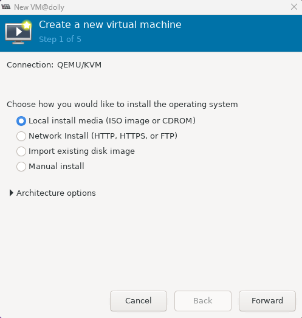
<br>
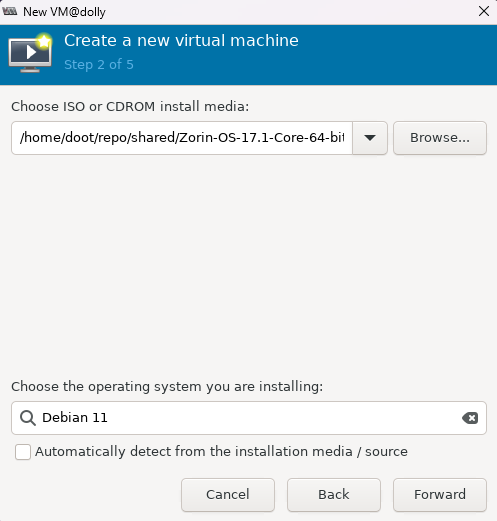
<br>
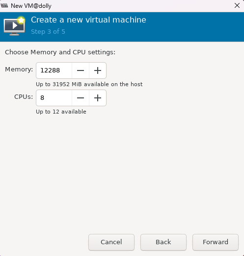
<br>
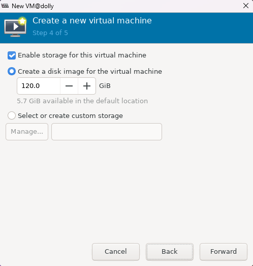
<br>
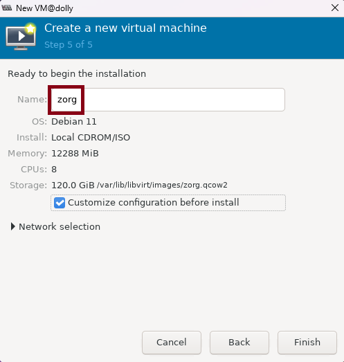

> **⚠️ Warning**  
> Remember to tick the *Customize configuration before install* checkbox.

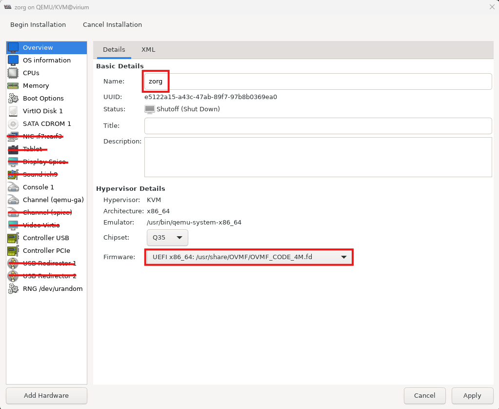
<br>
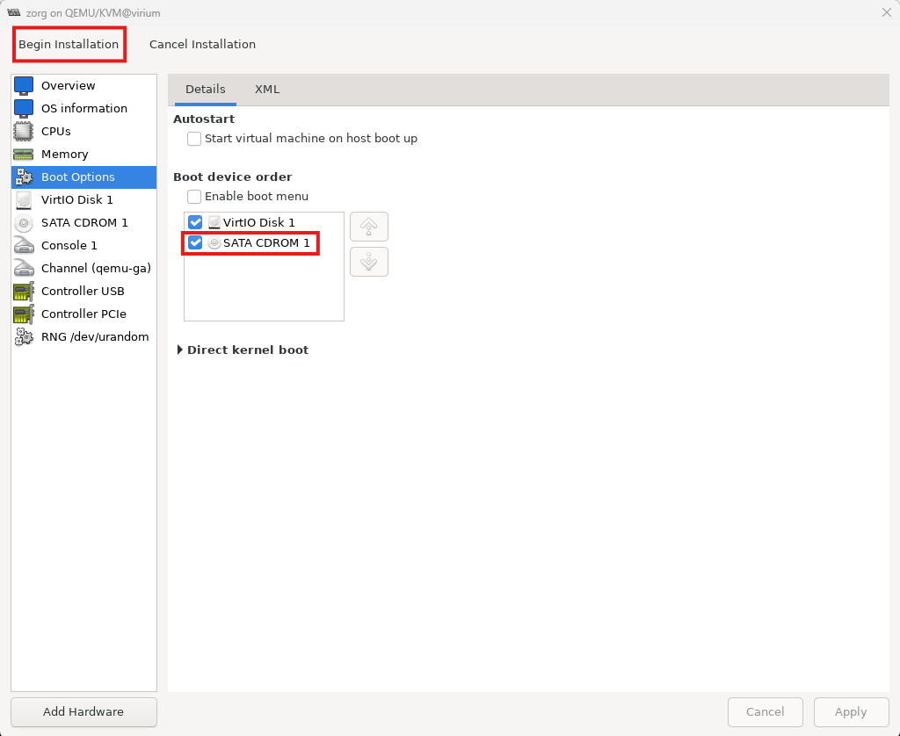

> **ⓘ Info**  
> - Remove unused hardware until it matches the figure above. 
> - The default console device is needed for guest-host communication to work.

After removing the unnecessary devices, we proceed with the installation by clicking "Begin Installation". **Once `zorg` is started, we immediately force shutdown `zorg`**.

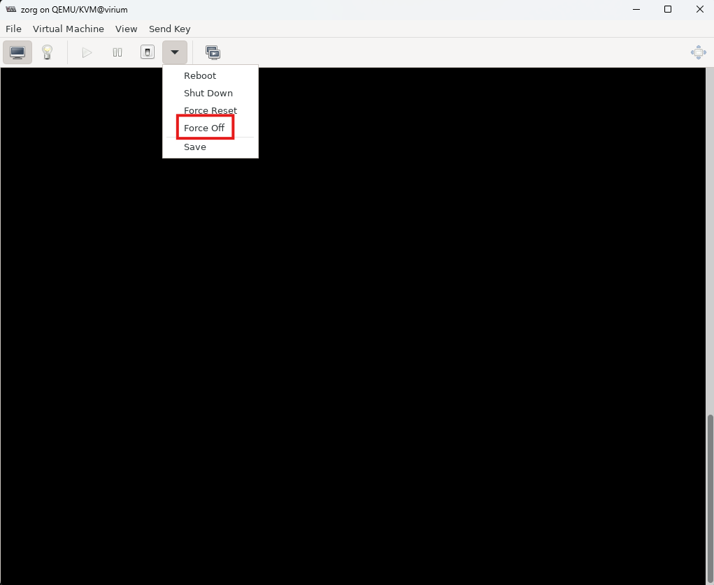

> **ⓘ Info**  
> Since passing through a primary GPU requires detaching a desktop session (or, in case of X11, a logging out,) sometimes guest XML definition will not be saved post-installation.
> The immediate force off is necessary to generate the guest XML definition beforehand, to mitigate said problems..

Aftewards, we proceed with adding the PCI devices to be passed through.

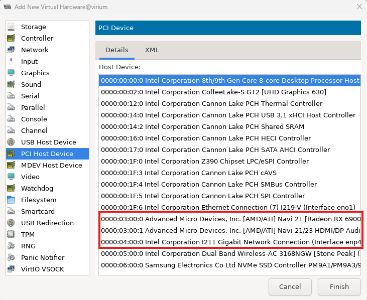
<br>
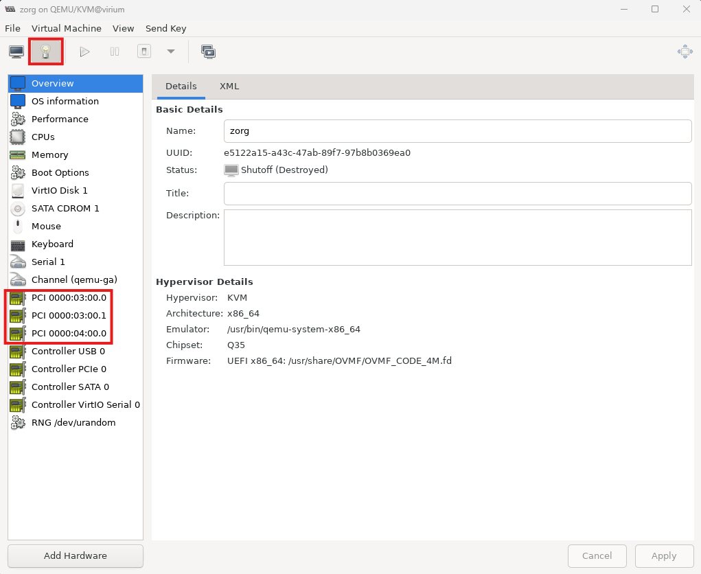

> **ⓘ Info**  
> - The `PCI 0000:03:00.0` is the Advanced Micro Devices, Inc. [AMD/ATI] Navi 21 [Radeon RX 6900 XT]. 
> - The `PCI 0000:03:00:1` is the Advanced Micro Devices, Inc. [AMD/ATI] Navi 21/23 HDMI/DP Audio Controller. 
> - The `PCI 0000:04:00.0` is the Intel Corporation I211 Gigabit Network Connection. 

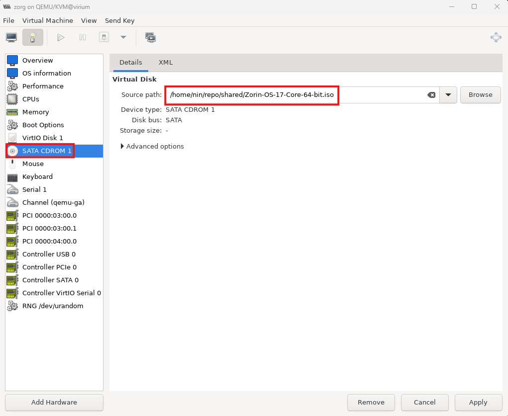

> **⚠️ Warning**  
> Don't forget to check if the ISO installer is still attached to the CDROM. If not, the installation will fail. 

**7.3.2. Run `virt-aid` Guest Setup**

```
$ sudo $VA_DISPATCH guest-setup
Type the vm name, followed by [ENTER] (Entering empty string to exit):
zorg
^^^^
Type the vm desc, followed by [ENTER]:

Initializing resources for zorg
Hooks setup completed.
Setup devices to passthrough (y/n)?
y
^
     1) ...
        ...
    19) 03:00.0 VGA compatible controller: Advanced Micro Devices, Inc. [AMD/ATI] Navi 21 [Radeon RX 6900 XT] (rev c0)
    20) 03:00.1 Audio device: Advanced Micro Devices, Inc. [AMD/ATI] Navi 21/23 HDMI/DP Audio Controller
    21) 04:00.0 Ethernet controller: Intel Corporation I211 Gigabit Network Connection (rev 03)
        ...
    23) ...
Enter the number of the pci device to be passed through (Enter blank to continue to the next step.):
19
^^
        ...
Enter the number of the pci device to be passed through (Enter blank to continue to the next step.):
20
^^
        ...
Enter the number of the pci device to be passed through (Enter blank to continue to the next step.):
21
^^
```

> **⚠️ Warning**  
> Give the exact name we gave in the `virt-manager`. Otherwise PCI passthrough will not work and system would crash. 

> **ⓘ Info**  
> If a guest doesn't need dedicated devices, skip this step.  In that case, or if a guest passes non-graphical PCI devices, `virt-aid` will exclude that guest from KVM switch guest list.

**7.3.3. Start `zorg` Installation**

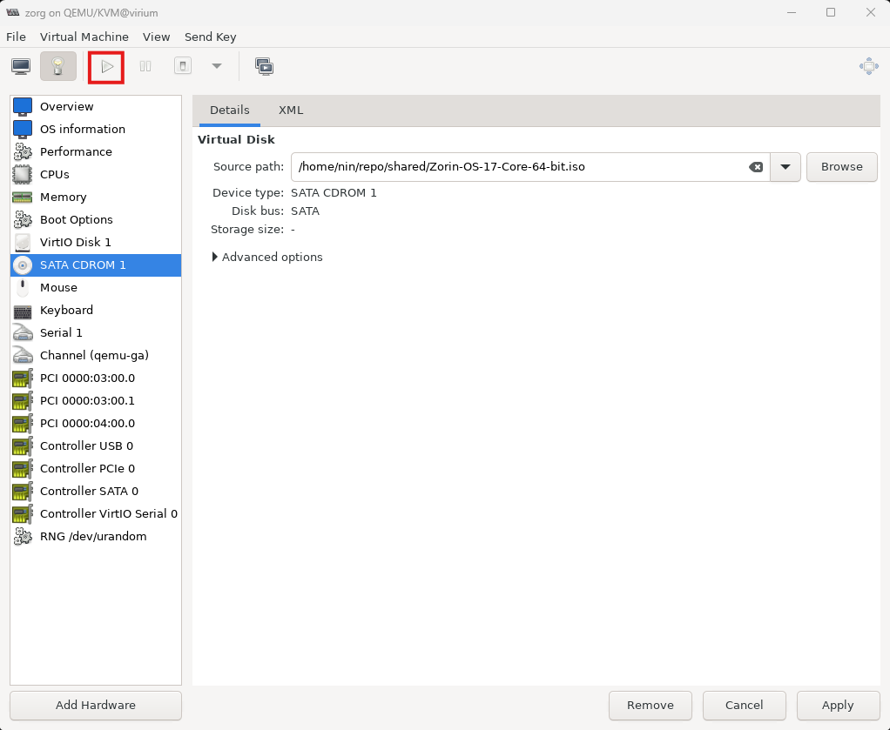

> **ⓘ Info**  
> After a successful guest installation, please refer to the section **Installation in Guest Environment** for installing `virt-aid` on guest.

### **7.4. Creating Our Second Guest `flux`**

> **ⓘ Info**  
> - Shutdown `zorg` if it is running before continuing. 
> - `flux` is a copy of `zorg` for showcasing `virt-aid` capabilities.
> - For `flux`, we will install Fedora 41.
> - Repeat the section **Creating Our First Guest `zorg`** and adjust the guest name accordingly. 

### **7.5. Creating Our Third Guest `debby`**

> **ⓘ Info**  
> - Shutdown any running guests. 
> - For this guest, we will assign the iGPU (integrated GPU) and the WiFi device.
> - For `debby` we will install Ubuntu 24.
> - Repeat the section **Creating Our First Guest `zorg`** and adjust accordingly. See below.

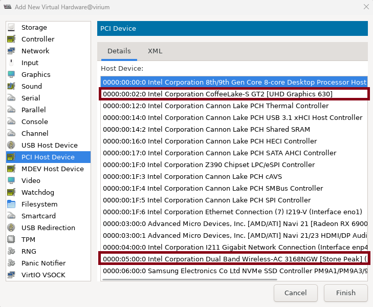

```
$ sudo $VA_DISPATCH guest-setup
Type the vm name, followed by [ENTER] (Entering empty string to exit):
flux
^^^^
Type the vm desc, followed by [ENTER]:

Initializing resources for zorg
Hooks setup completed.
Setup devices to passthrough (y/n)?
y
^
        ...
     3) 00:02.0 Display controller: Intel Corporation CoffeeLake-S GT2 [UHD Graphics 630] (rev 02)
        ...
    22) 05:00.0 Network controller: Intel Corporation Dual Band Wireless-AC 3168NGW [Stone Peak] (rev 10)
        ...
Enter the number of the pci device to be passed through (Enter blank to continue to the next step.):
3
^
        ...
Enter the number of the pci device to be passed through (Enter blank to continue to the next step.):
22
^^
```

### **7.6. Switcheroo**

```
sudo $VA_DISPATCH switch [target]
```

> **ⓘ Rules**  
> - The above command can be done from the guest itself (requiring that the guest also install `virt-aid`) or by `ssh`-ing to the host.
> - `target` can be guest names (`zorg`, `flux`, or `debby`) or `host`.
> - Switching from a guest to another that acquires the same GPU requires `virt-aid` to shutdown current guest and start the next one.
>   - `zorg` and `flux` cannot be active at the same time due to both of them having the same GPU.
> - Switching from/to a guest that has different GPU can be done normally.
>   - `zorg` or `flux` and `debby` can be active at the same time.
> - If a guest having a primary GPU is active, switching to host is disabled due to the host losing primary GPU.
> - Switching from a guest to an inactive target guest will automatically start the target guest.

> **💡 Tips**
>
> An external device which can ssh to the host machine would be very helpful.
>
> If problem occurs, e.g. monitor switch succeeds but input peripherals switch fails, or vice-versa:
>   - Change the monitor input manually to the host port,
>   - Unplug and re-plug the keyboard and mouse to the host.
>   - Now that the host has all I/O peripherals, debugging can start.
>
> For example, in case of blank screen, try:
>   - `sudo virsh reattach pci_0000_xx_xx_x`. 
>       - The above will re-attach the PCI/GPU device onto the host.
>       - Note that the PCI id can be found by probing `lspci` and/or `sudo virsh nodedev-list`.
>   - If the screen still blanks, run `sudo $VA_DISPATCH libvirt-hooks/vfio-teardown`
>       - The above will attempt to reconnect with desktop session/login. 
>

## **8. Future Work**

<table>
    <tr>
        <td><b>Topics</b></td>
        <td><b>Issues</b></td>
    </tr>
    <tr>
        <td>Current Issues</td>
        <td>Please refer to the <a href="https://github.com/outer-scope/virt-aid/issues">issues page</a>.</td>
    </tr>
    <tr>
        <td>Cross-Distro Testing</td>
        <td>Due to hardware and knowledge limitations, tests are only conducted on selected hardware on selected debian based distros.</td>
    </tr>
    <tr>
        <td>Security Enhancements</td>
        <td>Currently, the host-guest non-encrypted communication is done via a console device using `virt-aid` formatted XML based text messaging. Eventhough `virt-aid` only executes `virt-aid` commands, there might be better ways for host-guest to communicate. <br> <br> `virt-aid` allows own modules/plugins development using `angl`. The security, stability, and performance measurement of these plugins is very subjective and can hardly be measured. A better security policy will be needed to regulate published plugins.</td>
    </tr>
    <tr>
        <td>Friendlier UX</td>
        <td></td>
    </tr>
    <tr>
        <td>Cleaner Code and Architecture</td>
        <td></td>
    </tr>
    <tr>
        <td>`virt-aid` for Windows Guests</td>
        <td>At the moment there is no plan on developing `virt-aid` for windows due to time constraint, technical challenges, and reluctance.</td>
    </tr>
</table>

## **9. Sources and Credits**

Further online readings:
1. https://github.com/bryansteiner/gpu-passthrough-tutorial/
1. https://github.com/TikZSZ/vfio-gpu-passthrough
1. https://www.heiko-sieger.info/running-windows-10-on-linux-using-kvm-with-vga-passthrough/
